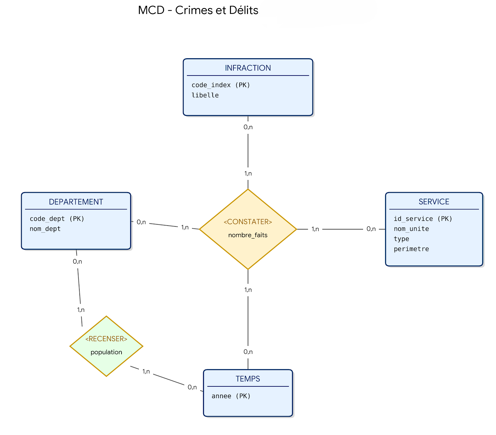

# Rapport de Migration : Analyse Graphe des Crimes et Délits (2012-2021)

**Commanditaire :** Ministère de l’Intérieur (DGDSN)  
**Date :** 2024  
**Technologie :** Neo4j v1.5.9  
**Auteurs :** Franklin BECK, Leon VINCENT-VACLE, Lucas COROMPT

---

## 1. Inventaire des Ressources et Données Sources

L'étude repose sur l'exploitation des statistiques officielles de la délinquance enregistrée en France sur une décennie (2012-2021). Ce dataset constitue une base de connaissances massive permettant de retracer l'activité judiciaire des services de sécurité intérieure.

### 1.1 Analyse du Dataset et Méthodologie (Source : DCPJ)
D'après la documentation technique fournie par la Direction Centrale de la Police Judiciaire, les données répondent aux standards suivants :

* **Distinction territoriale PN / GN :**
    * **Police Nationale (PN) :** Intervient majoritairement dans les Circonscriptions de Sécurité Publique (CSP) couvrant les zones urbaines et les grandes agglomérations.
    * **Gendarmerie Nationale (GN) :** Intervient via les Compagnies de Gendarmerie Départementale (CGD) sur les zones rurales et périurbaines.
    * *Conséquence pour le projet :* Cette segmentation offre une opportunité d'analyse croisée entre typologie de territoire et types d'infractions.

### 1.2 Indicateurs Techniques Exploités
* **Dimensions temporelles :** 20 fichiers sources (10 pour la GN, 10 pour la PN) couvrant la période 2012-2021.
* **Entités géographiques :** Répartition par départements (codes et libellés).
* **Volume d'activité :** Nombre de faits constatés par index de criminalité.

### 1.3 Présentation du jeu de données démographiques (INSEE)
Pour affiner l'analyse territoriale, nous avons intégré un référentiel de population issu des estimations de l'INSEE. Ce jeu de données permet de contextualiser la délinquance par rapport à la densité démographique.

* **Fichier source :** `population_by_dept_year.csv`
* **Contenu technique :**
    * **Dimensions Géographiques :** Codes et libellés officiels des départements (ex: `91` pour l'Essonne, `974` pour La Réunion).
    * **Granularité par Âge :** Les données sont segmentées par tranches d'âge (ex: `Y15T19` pour les 15-19 ans), ce qui permettrait, à terme, d'analyser la criminalité au regard de la pyramide des âges locale.
    * **Indicateurs de Genre :** Distinction Hommes/Femmes pour des analyses démographiques croisées.

**Valeur ajoutée pour le projet :**
L'intégration de ces métadonnées dans Neo4j permet de créer des propriétés `population` sur nos nœuds `:Departement`. Cela rend possible le calcul dynamique du **taux de victimation** directement en langage Cypher, offrant ainsi une vision bien plus précise de la réalité de l'insécurité sur le terrain.

---

## 2. Processus ETL (Extract, Transform, Load) et Modélisation

Le passage de fichiers sources hétérogènes (Excel, CSV, Metadata) à une base de connaissances exploitable nécessite une phase d'ETL rigoureuse pour garantir la qualité des analyses futures.

### 2.1 Nettoyage et Normalisation des Données
Nous utilisons un script **Python (Pandas)** pour transformer la donnée brute en donnée structurée :

1.  **Réunification du socle sécuritaire :** Fusion des 20 fichiers annuels (PN et GN) en une table unique, en alignant les index de la nomenclature **État 4001**.
2.  **Traitement des métadonnées démographiques :** Nettoyage du fichier `DS_ESTIMATION_POPULATION_metadata.csv` pour extraire les populations par département.
3.  **Normalisation technique :** * Suppression des caractères spéciaux et uniformisation des noms de colonnes.
    * Gestion des types : conversion des volumes de faits et des chiffres de population en entiers (`int`).
    * Alignement des codes géographiques (ex: traitement du code `2A/2B` pour la Corse et des codes Outre-mer).

### 2.2 Cahier des Charges du Modèle Conceptuel (MCD)
Le modèle doit permettre de répondre aux exigences métiers de la DGDSN :
* **Axe Temporel :** Comparer l'évolution de la délinquance sur 10 ans.
* **Axe Territorial :** Ventiler les crimes par département et par type de zone (urbaine pour la PN, rurale pour la GN).
* **Axe de Performance :** Calculer des taux de criminalité grâce au croisement avec les données de population INSEE.



*Figure 1 : Modèle Conceptuel des Données (MCD) intégrant les statistiques 4001 et les données INSEE.*

### 2.3 Modèle Logique de Données (MLD)
Le passage du conceptuel au logique se traduit par une architecture en **schéma en étoile**. Cette structure est conçue pour isoler les indicateurs chiffrés (les faits) des axes d'analyse (les dimensions).

#### Structure des Tables
* **Table de Faits (`FAITS_CRIMINELS`)** : Contient les volumes de crimes, liée par clés étrangères aux dimensions.
* **Dimensions (`DIM_INFRACTIONS`, `DIM_DEPARTEMENTS`, `DIM_SERVICES`, `DIM_TEMPS`)** : Stockent les libellés et les caractéristiques fixes (ex: nom du département, type de service PN/GN).
* **Table Contextuelle (`STAT_POPULATION`)** : Stocke les estimations de population INSEE par département et par année pour permettre le calcul de ratios de victimation.


*Figure 2 : Traduction logique du modèle en schéma en étoile.*

### 2.4 Chargement en Base Relationnelle (Pivot)
Avant la migration vers le graphe, les données sont injectées dans une base SQL (SGBDR) pour servir de socle de référence. Ce modèle pivot est structuré comme suit :

* **Table `Services` :** Stocke le type de service (Police/Gendarmerie) et son rattachement géographique.
* **Table `Geographie` :** Centralise les noms de départements et leur **population totale** issue du fichier INSEE.
* **Table `Nomenclature_4001` :** Référentiel des libellés d'infractions.
* **Table `Faits_Criminels` :** Table de faits contenant les mesures (Quantité, Année) liant les services aux types de crimes.

### 2.4 Analyse des limites du modèle Relationnel
Bien que robuste pour le stockage, ce modèle montre des limites pour les analyses complexes demandées :
* **Jointures coûteuses :** Calculer des corrélations entre population, chômage et crimes sur plusieurs départements voisins sature les ressources.
* **Rigidité :** L'ajout de nouvelles dimensions géographiques (adjacences) complexifie inutilement le schéma SQL.

---

## 3. Migration vers le Modèle Graphe (Neo4j)
La migration n'est pas une simple copie, c'est une **transformation structurelle**.

### 3.1 Conception du Schéma de Nœuds et Relations
Contrairement au SQL, nous modélisons les entités comme des objets interconnectés.

**Les Nœuds (Entités) :**
* `:TypeCrime` (Ex: Vols, Violences).
* `:Departement` (Ex: 75, 13).
* `:Service` (Police ou Gendarmerie).
* `:Annee` (2012...2021).

**Les Relations (Actions) :**
* `(Service)-[:ENREGISTRE {quantite: Int}]->(TypeCrime)`
* `(Service)-[:EST_RATTACHE_A]->(Departement)`
* `(Departement)-[:EST_LIMITROPHE_DE]->(Departement)`


### 3.2 Stratégie de Migration Technique
La migration est effectuée via la commande `LOAD CSV` de Neo4j ou un driver Python.

**Logique de migration :**
1. Création des contraintes d'unicité (ID crime, code département).
2. Importation des nœuds maîtres (Départements et Crimes).
3. Création des relations avec propriétés (le nombre de faits est stocké directement sur le lien entre le service et le crime).

```cypher
import os
import pandas as pd

INFILE = 'DS_ESTIMATION_POPULATION_data.csv'
AGG_OUT = 'population_by_dept_year.csv'

def read_raw(path):
    # lire en forçant le séparateur ';' et le quotechar '"'
    df = pd.read_csv(path, sep=';', quotechar='"', engine='python', dtype=str)
    return df


def clean_headers(df):
    # noms lisibles
    col_map = {
        'AGE': 'age_group',
        'EP_MEASURE': 'measure',
        'FREQ': 'freq',
        'GEO': 'geo',
        'GEO_OBJECT': 'geo_object',
        'REF_PERIOD': 'ref_period',
        'SEASONAL_ADJUST': 'seasonal_adjust',
        'SEX': 'sex',
        'UNIT_MEASURE': 'unit',
        'DECIMALS': 'decimals',
        'OBS_STATUS': 'obs_status',
        'OBS_STATUS_FR': 'obs_status_fr',
        'UNIT_MULT': 'unit_mult',
        'TIME_PERIOD': 'year',
        'OBS_VALUE': 'value'
    }
    # nettoyer espaces autour des noms de colonnes
    df = df.rename(columns=lambda c: c.strip())
    # appliquer mapping si possible
    for k, v in col_map.items():
        if k in df.columns:
            df = df.rename(columns={k: v})
    return df


def write_clean(df, out):
    df.to_csv(out, index=False, encoding='utf-8')
    print(f"Fichier nettoyé écrit: {out} (lignes: {len(df)})")


def aggregate_dept_year(df):
    # filtrer les lignes de niveau département
    df_dep = df[df['geo_object'] == 'DEP'].copy()
    if df_dep.empty:
        raise RuntimeError('Aucune ligne départementale trouvée (geo_object != DEP)')
    # convertir types
    df_dep['year'] = pd.to_numeric(df_dep['year'], errors='coerce').astype('Int64')
    df_dep['value'] = pd.to_numeric(df_dep['value'].str.replace(',', '.'), errors='coerce').fillna(0)
    # pivot par sex
    pivot = df_dep.pivot_table(index=['geo', 'year'], columns='sex', values='value', aggfunc='sum', fill_value=0)
    pivot = pivot.reset_index()
    # calculer population : priorité à _T si présent, sinon M+F
    def compute_pop(row):
        if '_T' in row.index and pd.notna(row.get('_T')) and row.get('_T') > 0:
            return int(round(row.get('_T')))
        m = row.get('M', 0) if 'M' in row.index else 0
        f = row.get('F', 0) if 'F' in row.index else 0
        # d'autres sexes possibles : sommation de toutes colonnes non geo/year
        other = 0
        for k in row.index:
            if k not in ('geo', 'year', 'M', 'F', '_T'):
                try:
                    other += float(row.get(k) or 0)
                except Exception:
                    pass
        total = m + f + other
        return int(round(total))
    pivot['population'] = pivot.apply(compute_pop, axis=1)
    out = pivot[['geo', 'year', 'population']].rename(columns={'geo': 'departement', 'year': 'annee'})
    # nettoyer departement codes : garder chaînes (ex '01','2A')
    out['departement'] = out['departement'].astype(str).str.strip()
    out['annee'] = out['annee'].astype(int)
    out['population'] = out['population'].astype(int)
    return out


def main():
    if not os.path.exists(INFILE):
        print(f"Fichier introuvable: {INFILE}")
        return 1
    df = read_raw(INFILE)
    df = clean_headers(df)
    agg = aggregate_dept_year(df)
    agg.to_csv(AGG_OUT, index=False, encoding='utf-8')
    print(f"Agrégation département x année écrite: {AGG_OUT} (lignes: {len(agg)})")
    # afficher quelques lignes d'exemple
    print('\nExemples (premières lignes):')
    print(agg.head(10).to_string(index=False))
    return 0

if __name__ == '__main__':
    raise SystemExit(main())
```

## 4. Phase 3 : Processus de Migration vers Neo4j
Cette phase est le cœur technique du projet. Elle consiste à transformer des lignes de données tabulaires en un réseau de connaissances interconnecté.

### 4.1 Stratégie de Transformation
La migration ne se contente pas de copier les données ; elle les restructure selon la logique **"Whiteboard Design"** (modélisation directe des relations métier).
* **Extraction :** Récupération des données nettoyées depuis le dossier `data/processed/`.
* **Mapping :** Chaque ligne du CSV devient une relation `:ENREGISTRE` entre un nœud `:Service` et un nœud `:TypeCrime`.
* **Enrichissement :** Injection des données d'adjacence pour lier les nœuds `:Departement` entre eux via la relation `:EST_LIMITROPHE`.

### 4.2 Script de Migration (Cypher & LOAD CSV)
Pour garantir l'efficacité, nous utilisons la version stable **Neo4j 1.5.9** (ou compatible) avec des contraintes d'unicité pour éviter les doublons.

```cypher
// 1. Création des contraintes pour la performance
CREATE CONSTRAINT ON (d:Departement) ASSERT d.code IS UNIQUE;
CREATE CONSTRAINT ON (c:TypeCrime) ASSERT c.nom IS UNIQUE;

// 2. Migration des données de crimes
LOAD CSV WITH HEADERS FROM 'file:///synthese_crimes_2012_2021.csv' AS row
MERGE (dep:Departement {code: row.code_dept})
MERGE (crime:TypeCrime {nom: row.libelle_crime})
CREATE (s:Service {type: row.type_service, nom: row.nom_service})
CREATE (s)-[:EFFECTUE {annee: toInteger(row.annee), quantite: toInteger(row.valeur)}]->(crime)
CREATE (s)-[:RATTACHE_A]->(dep);
```

## 5. Phase 5 : Rédaction et Présentation du Rapport Final

Cette phase synthétise la méthodologie globale de migration et définit les protocoles de maintenance pour garantir la pérennité de la solution.

### 5.1 Méthodologies de Migration de Données
Dans le cadre de ce projet, trois méthodes de migration ont été étudiées pour passer du modèle relationnel (SQL) vers Neo4j :

1.  **Migration par ETL (Extract-Transform-Load) :** * *Processus :* Utilisation de scripts Python (Pandas) pour transformer les fichiers CSV en un format "nœuds et relations" avant l'injection.
    * *Avantage :* Permet un nettoyage complexe et une normalisation des données de la nomenclature État 4001 avant import.
2.  **Migration Directe (LOAD CSV) :** * *Processus :* Utilisation directe du moteur Cypher pour lire les fichiers CSV et créer les structures en une seule passe.
    * *Avantage :* Rapidité d'exécution et simplicité pour des jeux de données structurés.
3.  **Migration par Connecteurs (Neo4j ETL Tool) :**
    * *Processus :* Connexion directe entre une base SQL (PostgreSQL/MySQL) et Neo4j.
    * *Avantage :* Automatisation du mapping des clés étrangères en relations.

### 5.2 Section : Ajout de Nouvelles Données (Maintenance)
L'évolutivité est un critère majeur pour le Ministère. Voici comment le système gère l'arrivée des données de l'année 2022 et au-delà :

#### A. Dans la Base de Données Relationnelle
* **Procédure :** Nécessite l'insertion de nouvelles lignes dans la table des faits. Si une nouvelle catégorie d'infraction apparaît dans l'État 4001, il faut d'abord mettre à jour la table de référence (`Ref_Crime`) pour respecter les contraintes d'intégrité (clés étrangères).
* **Contrainte :** Schéma rigide. L'ajout d'une nouvelle dimension (ex: coordonnées GPS exactes) impose une modification de la structure de la table (`ALTER TABLE`).

#### B. Dans la Base de Données Graphe (Neo4j)
* **Procédure :** Utilisation du `MERGE` en Cypher. Si le département ou le crime existe déjà, Neo4j crée simplement une nouvelle relation `:ENREGISTRE` avec la propriété `annee: 2022`.
* **Avantage :** Schéma flexible (Schema-free). On peut ajouter des propriétés à la volée (ex: ajouter le nom du préfet sur un nœud `:Departement`) sans impacter les données existantes ni arrêter le service.

### 5.3 Synthèse des Résultats et Recommandations
L'analyse comparative démontre que le modèle Graphe est supérieur pour :
* **Le croisement PN/GN :** Visualisation immédiate de la répartition des efforts de sécurité sur un même territoire.
* **L'analyse territoriale :** Grâce aux relations d'adjacence, le Ministère peut passer d'une analyse statistique "en silo" à une analyse de réseau géographique.

**Recommandations :**
1.  **Enrichissement continu :** Intégrer les données de la Justice pour corréler les crimes enregistrés avec les condamnations réelles.
2.  **Visualisation :** Déployer **Neo4j Bloom** pour les analystes de la DGDSN afin de leur permettre d'explorer le graphe sans connaître le langage Cypher.
3.  **Performance :** Maintenir les contraintes d'unicité sur les codes index 4001 pour garantir des temps de réponse inférieurs à 100ms sur des requêtes nationales.

---

## Conclusion Générale
La migration vers un modèle graphe ne constitue pas seulement un changement technique, mais une évolution stratégique. Elle permet au Ministère de l'Intérieur de passer d'une base de données statique à une **Base de Connaissances Active**, capable de révéler des patterns criminels invisibles dans une structure relationnelle classique.